# Tasks Index: CLI Authentication and Comment Management

Beads Issue Graph Index into the tasks and phases for this feature implementation.
This index does **not contain tasks directly**—those are fully managed through Beads CLI.

## Feature Tracking

* **Beads Epic ID**: `sl-0ah`
* **User Stories Source**: `specledger/009-add-login-and-comment-commands/spec.md`
* **Research Inputs**: `specledger/009-add-login-and-comment-commands/research.md`
* **Planning Details**: `specledger/009-add-login-and-comment-commands/plan.md`
* **Data Model**: `specledger/009-add-login-and-comment-commands/data-model.md`
* **Contract Definitions**: `specledger/009-add-login-and-comment-commands/contracts/`

## Beads Query Hints

Use the `bd` CLI to query and manipulate the issue graph:

```bash
# Find all open tasks for this feature
bd list --label spec:009-add-login-and-comment-commands --status open -n 20

# Find ready tasks to implement
bd ready --label spec:009-add-login-and-comment-commands -n 5

# See dependencies for issue
bd dep tree sl-0ah

# View issues by phase
bd list --label phase:US1 --label spec:009-add-login-and-comment-commands
bd list --label phase:US2 --label spec:009-add-login-and-comment-commands

# View issues by user story
bd list --label story:US1 --label spec:009-add-login-and-comment-commands
bd list --label story:US2 --label spec:009-add-login-and-comment-commands

# Show all phases (features)
bd list --type feature --label spec:009-add-login-and-comment-commands
```

## Tasks and Phases Structure

This feature follows Beads' 2-level graph structure:

* **Epic**: sl-0ah → CLI Authentication and Comment Management
* **Phases**: Beads issues of type `feature`, children of the epic
  * Phase 1: Setup (sl-6rw)
  * Phase 2: Foundational (sl-0kf)
  * Phase 3: US1 - CLI Login (sl-0er) 🎯 **MVP**
  * Phase 4: US2 - View Comments (sl-bvz)
  * Phase 5: US3 - Resolve Comment (sl-cdg)
  * Phase 6: US4 - CLI Logout (sl-agx)
  * Phase 7: Polish (sl-71a)
* **Tasks**: Issues of type `task`, children of each feature issue (phase)

## Convention Summary

| Type    | Description                  | Labels                                      |
| ------- | ---------------------------- | ------------------------------------------- |
| epic    | Full feature epic            | `spec:009-add-login-and-comment-commands`   |
| feature | Implementation phase / story | `phase:[name]`, `story:[US#]`               |
| task    | Implementation task          | `component:[x]`, `fr:[FR-XXX]`              |

## Phase Summary

### Phase 1: Setup (sl-6rw)
**Purpose**: Project setup and configuration validation

| Task ID | Title | Priority | FR |
|---------|-------|----------|-----|
| sl-d1o | Add session.json to .gitignore | P1 | FR-014 |
| sl-4w5 | Validate .claude/commands structure | P2 | FR-001 |

### Phase 2: Foundational (sl-0kf)
**Purpose**: Core infrastructure - MUST complete before user stories

| Task ID | Title | Priority | FR |
|---------|-------|----------|-----|
| sl-z74 | Implement session validation logic | P1 | FR-003, FR-007 |
| sl-2aj | Configure Supabase API constants | P1 | FR-012 |

### Phase 3: US1 - CLI Login (sl-0er) 🎯 MVP
**Goal**: Authenticate user via browser token paste

| Task ID | Title | Priority | FR |
|---------|-------|----------|-----|
| sl-8tr | Validate login command opens browser | P1 | FR-001 |
| sl-f43 | Validate token paste and format validation | P1 | FR-002, FR-003 |
| sl-m9y | Validate session file creation with permissions | P1 | FR-004, FR-005 |

### Phase 4: US2 - View Comments (sl-bvz)
**Goal**: Display comments on specification files

| Task ID | Title | Priority | FR |
|---------|-------|----------|-----|
| sl-sik | Validate comment command auth check | P2 | FR-007 |
| sl-cqh | Validate comment fetch from Supabase | P2 | FR-008, FR-012 |
| sl-qjw | Validate comment display formatting | P2 | FR-009 |

### Phase 5: US3 - Resolve Comment (sl-cdg)
**Goal**: Mark comments as resolved

| Task ID | Title | Priority | FR |
|---------|-------|----------|-----|
| sl-tq3 | Validate resolve-comment auth check | P2 | FR-007 |
| sl-87q | Validate resolve-comment API call | P2 | FR-010, FR-011, FR-012 |

### Phase 6: US4 - CLI Logout (sl-agx)
**Goal**: Clear user credentials

| Task ID | Title | Priority | FR |
|---------|-------|----------|-----|
| sl-11d | Validate logout removes session file | P3 | FR-006 |
| sl-55y | Validate logout graceful handling | P3 | FR-006 |

### Phase 7: Polish (sl-71a)
**Purpose**: Security validation and edge case handling

| Task ID | Title | Priority | FR |
|---------|-------|----------|-----|
| sl-3qr | Validate no token logging | P2 | FR-013 |
| sl-bnr | Validate edge case error handling | P2 | - |
| sl-e8u | Run quickstart.md validation | P3 | - |

## Execution Order

```mermaid
flowchart TD
    P1[Phase 1: Setup] --> P2[Phase 2: Foundational]
    P2 --> US1[US1: Login 🎯 MVP]
    P2 --> US2[US2: View Comments]
    P2 --> US3[US3: Resolve Comment]
    P2 --> US4[US4: Logout]
    US1 --> P7[Phase 7: Polish]
    US2 --> P7
    US3 --> P7
    US4 --> P7
```



## MVP Scope

**Suggested MVP**: Phase 1 + Phase 2 + Phase 3 (US1: CLI Login)

With US1 complete, users can:
- Authenticate with the CLI
- Session is stored securely

This is the minimum viable product because:
- Authentication is the foundation for all protected operations
- Other features (comments) depend on being logged in
- Can be tested end-to-end in isolation

## Implementation Notes

**Important**: Commands already exist in `.claude/commands/`. Tasks are primarily validation and testing.

| Command File | Status |
|--------------|--------|
| specledger.login.md | Defined - needs validation |
| specledger.logout.md | Defined - needs validation |
| specledger.comment.md | Defined - needs validation |
| specledger.resolve-comment.md | Defined - needs validation |

## Status Tracking

Status is tracked only in Beads:

* **Open** → default
* **In Progress** → task being worked on
* **Blocked** → dependency unresolved
* **Closed** → complete

```bash
# Check current progress
bd stats --label spec:009-add-login-and-comment-commands

# Find blocked tasks
bd blocked --label spec:009-add-login-and-comment-commands

# Get ready tasks to work on
bd ready --label spec:009-add-login-and-comment-commands -n 5
```

---

> This file is intentionally light and index-only. Implementation data lives in Beads. Update this file only to point humans and agents to canonical query paths and feature references.
